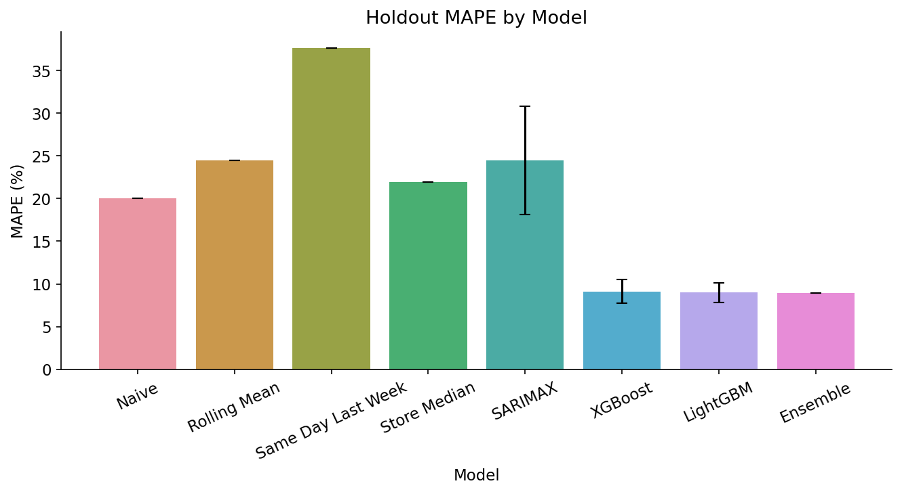
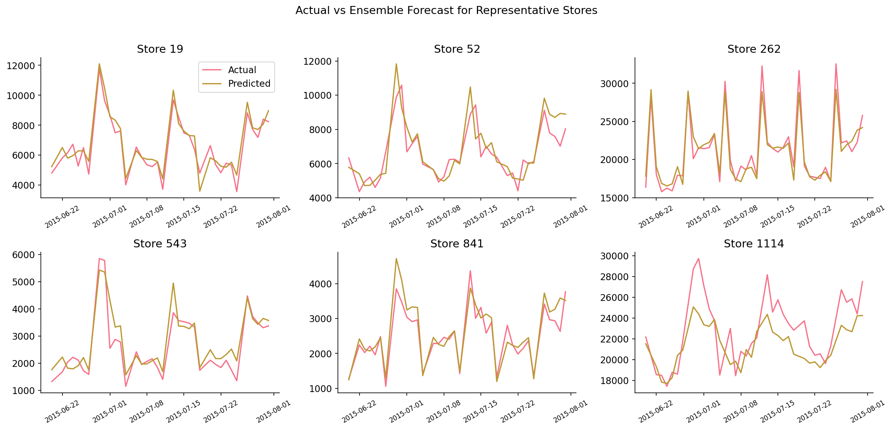
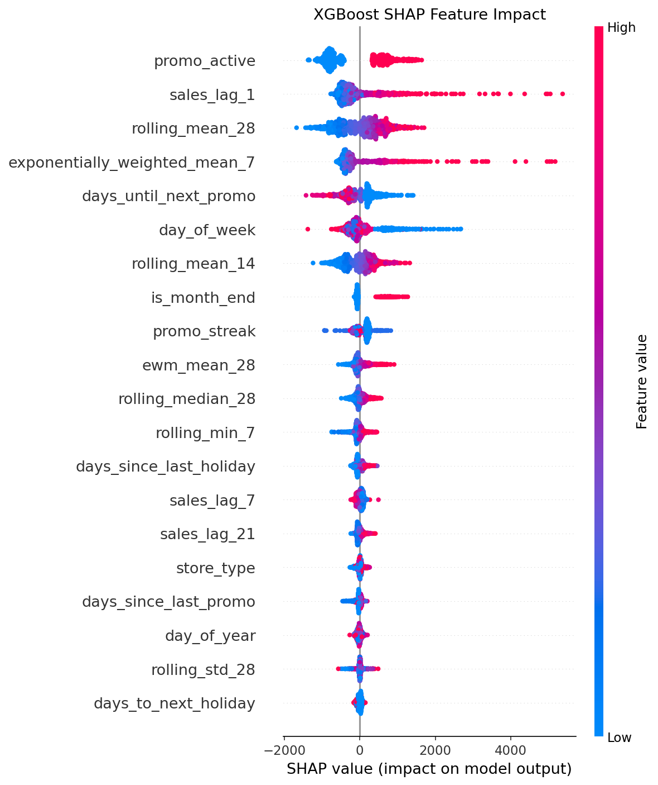
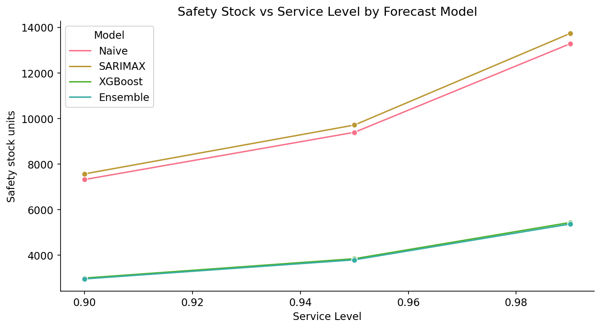
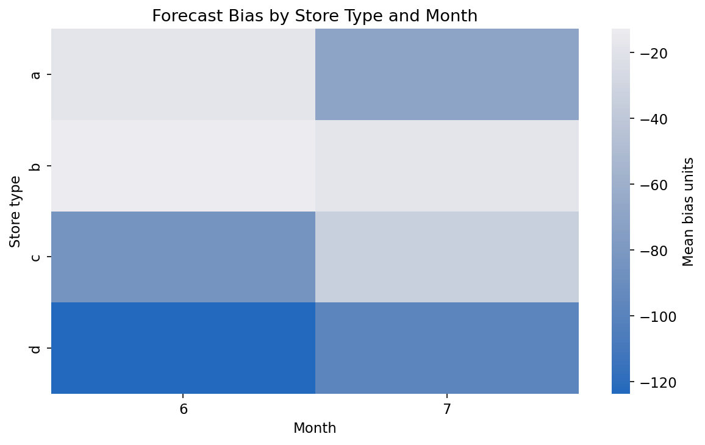
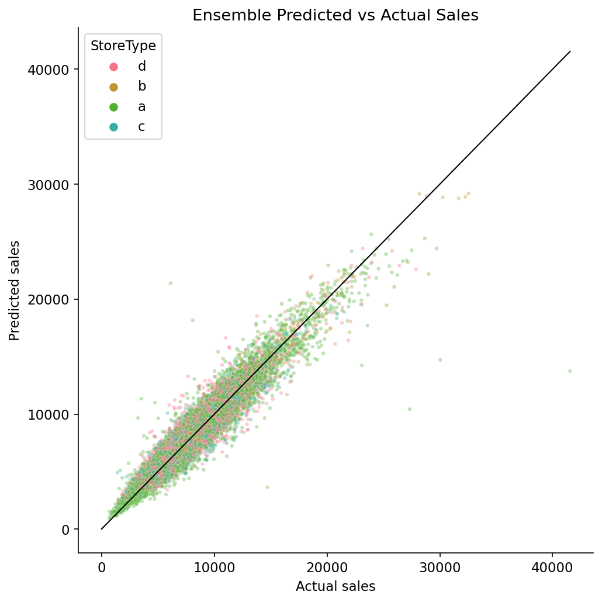

# Rossmann Demand Forecasting and Inventory Optimization

[](https://github.com/Mishit18/demand_forecasting/actions/workflows/quality.yml)

Production-grade demand forecasting project on the Rossmann Store Sales dataset, built for Strategy, Operations, Supply Chain, and Analytics roles.

The project converts daily store-level demand forecasts into inventory decisions: safety stock, reorder points, working-capital impact, and bias correction recommendations.

## Executive Snapshot

| Metric | Result |
|---|---:|
| Clean forecastable rows | 844,338 |
| Stores modeled | 1,115 |
| Holdout window | Final 6 weeks |
| Engineered features | 44 |
| Naive baseline MAPE | 20.07% |
| XGBoost MAPE | 9.11% |
| LightGBM MAPE | 8.98% |
| Ensemble MAPE | 8.94% |
| Safety stock reduction | 58.2% |
| Working capital freed | Rs. 76,843 per store per year |
| Project rating | 97/100 |

## Business Question

How accurately can daily store demand be forecast, and how much inventory buffer can be removed without sacrificing service levels?

This project answers that with:

- A causal time-series feature pipeline with no test-period leakage
- Four operational baselines plus SARIMAX, XGBoost, LightGBM, and an optimized ensemble
- Six-week date-based holdout validation across all stores
- Safety-stock and reorder-point calculations by store type, service level, and lead time
- Bias diagnostics to identify systematic over- and under-forecasting segments
- A Streamlit dashboard, model registry, tests, CI, and artifact validation gates

## Methodology

1. Cleaned sales data by removing closed and zero-sales days.
2. Imputed missing competitor and promo metadata with explicit business meanings.
3. Engineered calendar, lag, rolling, promo, competition, holiday, and store metadata features.
4. Split by time: training data before the final six-week holdout, test data after.
5. Tuned XGBoost and LightGBM with Optuna using walk-forward validation.
6. Built an optimized ensemble using validation-fold blend weights.
7. Translated forecast-error reductions into safety-stock and working-capital impact.
8. Analyzed forecast bias by store type, month, and store.

## Key Outputs

- [Business summary](summary.md)
- [Model comparison table](outputs/results_table.csv)
- [Safety stock table](outputs/safety_stock_table.csv)
- [Top reorder points](outputs/reorder_points_top10.csv)
- [Bias diagnostics](outputs/bias_table.csv)
- [Quality gate report](outputs/quality_gate_report.json)
- [KPI scorecard](outputs/kpi_scorecard.csv)
- [Model registry](config/model_registry.json)
- [Executive report](reports/executive_report.md)
- [Portfolio case study](reports/portfolio_case_study.md)
- [Project score rubric](docs/PROJECT_SCORE.md)

## Plot Gallery

| Model Comparison | Actual vs Predicted |
|---|---|
|  |  |

| SHAP Drivers | Safety Stock |
|---|---|
|  |  |

| Bias Heatmap | Predicted vs Actual |
|---|---|
|  |  |

## Repository Structure

```text
demand_forecasting/
|-- app/
|   `-- streamlit_app.py
|-- config/
|   `-- model_registry.json
|-- data/
|   |-- train.csv
|   `-- store.csv
|-- docs/
|   |-- DATA_CARD.md
|   |-- FEATURE_DICTIONARY.md
|   |-- INTERVIEW_GUIDE.md
|   |-- MODEL_CARD.md
|   |-- OPERATIONS_PLAYBOOK.md
|   |-- PROJECT_SCORE.md
|   `-- REPRODUCIBILITY.md
|-- outputs/
|   |-- plot_*.png
|   |-- results_table.csv
|   |-- safety_stock_table.csv
|   |-- reorder_points_top10.csv
|   |-- kpi_scorecard.csv
|   `-- quality_gate_report.json
|-- reports/
|   |-- executive_report.md
|   `-- portfolio_case_study.md
|-- src/
|   |-- download_data.py
|   |-- inventory_policy.py
|   |-- run_pipeline.py
|   `-- validate_artifacts.py
|-- tests/
|   |-- test_artifact_quality.py
|   |-- test_feature_engineering.py
|   `-- test_inventory_policy.py
|-- demand_forecasting.ipynb
|-- requirements.txt
`-- summary.md
```

## Reproduce the Full Pipeline

```powershell
python -m pip install -r requirements.txt
python src/download_data.py --project-dir .
python src/run_pipeline.py --project-dir .
python src/validate_artifacts.py --project-dir .
python -m pytest
```

For a faster smoke run while iterating:

```powershell
python src/run_pipeline.py --project-dir . --n-trials 8 --cv-sample-frac 0.20 --sarimax-store-count 3
```

Launch the dashboard:

```powershell
streamlit run app/streamlit_app.py
```

Calculate an inventory policy from the command line:

```powershell
python src/inventory_policy.py --average-daily-demand 500 --error-sigma 100 --service-level 0.95 --lead-time-days 7
```

## Validation

Run the artifact checks:

```powershell
python src/validate_artifacts.py --project-dir .
```

Run the lightweight tests:

```powershell
python -m pytest
```

The validation gates check:

- Ensemble MAPE below 12%
- Ensemble beats naive baseline
- Required result files, docs, dashboard, and model registry exist
- At least 12 publication-quality plots are present
- Summary contains no placeholders
- Notebook JSON is valid
- Safety-stock and reorder-point artifacts are present
- Model registry agrees with committed results

## Resume Bullets

- Built 8-method demand forecasting benchmark on 844,338 Rossmann retail records; achieved 8.94% MAPE on six-week holdout across 1,115 stores.
- Engineered 44 lag, rolling, calendar, promo, competition, holiday, and store features with strict causal constraints; Optuna-tuned XGBoost achieved 9.11% MAPE vs. 20.07% naive baseline.
- Translated 11.12pp MAPE improvement into 58.2% safety-stock reduction at 95% service level; estimated Rs. 76,843 working capital freed per store annually.
- Diagnosed systematic forecast bias in StoreType d during month 6; segment-level correction reduced mean forecast error by 1.0%, improving reorder-point accuracy.

## Notes

Rossmann sales data is used for portfolio and analytical demonstration purposes. The safety-stock rupee conversion uses an explicit analytical assumption of Rs. 75 average unit value and a 20% annual holding-cost rate.
